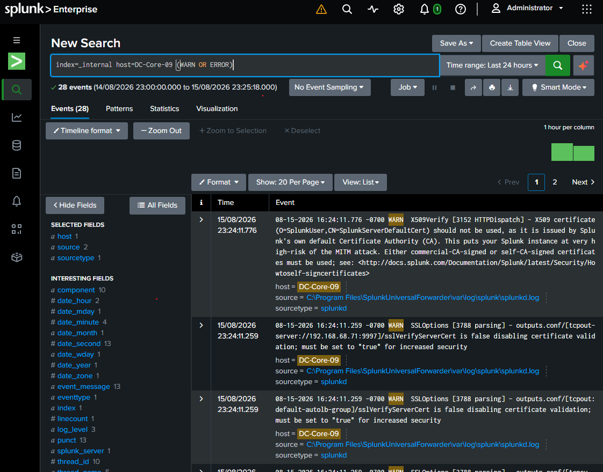

# Home Lab Project: Splunk Security Detection Engineering & Dashboards

## Repository Structure

```text
splunk-detection-lab/
├── assets/
│   └── execution.png           # Verification screenshot
├── configs/
│   └── inputs.conf             # Forwarder telemetry
├── data/
│   └── sample_events.json      # Sample event logs
├── queries/
│   └── security_detections.spl # Custom SPL rules
├── .gitignore
└── README.md
```

## 1. Project Overview & Architecture

- **Environment**: Home lab SIEM architecture featuring Splunk Enterprise, Splunk Universal Forwarders, and Windows Server 2022 Active Directory telemetry sources.
- **Core Tools**: Splunk Enterprise, Search Processing Language (SPL), Sysmon, Windows Security Event Logs, Git, and GitHub.
- **Objective**: Design, build, and document custom security detection engineering rules, threat hunting queries, and operational monitoring dashboards within Splunk. This repository formalizes detection logic to catch common administrative abuse, lateral movement, and authentication anomalies.

## 2. Detection Engineering Library & SPL Rules

The repository includes production-ready detection queries organized within `queries/security_detections.spl`:

### Brute-Force Authentication Tracking (`EventCode 4625`)

Aggregates failed login attempts by source IP address and target account, triggering alerts when high-frequency thresholds are breached.

```spl
index=windows sourcetype=WinEventLog:Security EventCode=4625 
| stats count(_raw) as failed_attempts by Source_Network_Address Account_Name 
| where failed_attempts > 5 
| sort -failed_attempts
```

### Privileged Group Modifications (`EventCode 4728`)

Monitors additions of user accounts to security-enabled global groups (such as `Domain Admins`), capturing potential persistence and privilege escalation vectors.

```spl
index=windows sourcetype=WinEventLog:Security EventCode=4728 
| table _time ComputerName Account_Name GroupName Caller_User_Name
```

### Suspicious PowerShell Execution (Sysmon `EventCode 1`)

Flags obfuscated command lines, encoded payloads, or memory-injection routines by analyzing process creation telemetry.

```spl
index=windows sourcetype=XmlWinEventLog:Microsoft-Windows-Sysmon/Operational EventCode=1 
(CommandLine="*EncodedCommand*" OR CommandLine="*Invoke-Expression*" OR CommandLine="*DownloadString*") 
| table _time ComputerName User CommandLine ParentImage
```

## 3. Configuration & Ingestion Parameters

- **Log Forwarding**: Configured via Splunk Universal Forwarders on domain endpoints streaming Windows Event Logs and Sysmon XML logs to the central Splunk Enterprise indexer.
- **Index Partitioning**: Telemetry is segregated into dedicated indexes (e.g., `windows`, `sysmon`) to optimize search performance and role-based access control.

## 4. Usage & Query Execution Guide

1. Log into your Splunk Enterprise Web UI with appropriate analyst privileges.
2. Navigate to Search & Reporting.
3. Copy desired detection rules from `queries/security_detections.spl` into the search bar.
4. Set the appropriate global time range (e.g., Last 24 hours or Real-time) and execute the query to validate environment ingestion.

## 5. File & Directory Descriptions

| Path | Description |
|---|---|
| `assets/` | Contains visual verification screenshots of successful query execution. |
| `configs/` | Contains forwarder ingestion configurations (`inputs.conf`). |
| `data/` | Stores sample structured event payloads for offline testing. |
| `queries/` | Houses custom Search Processing Language (SPL) detection rules. |
| `README.md` | Comprehensive technical documentation and threat detection guide. |

## 6. Execution Output & Verification


